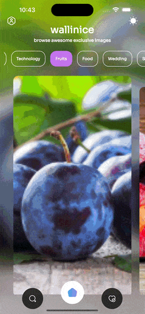

- A great flutter and efficacious package for an **on-tap bounce** animation on any flutter widget

    
## Usage

To use this package, add `bounce_tap` as a [dependency in your pubspec.yaml file](https://flutter.dev/docs/development/packages-and-plugins/using-packages).

## Demo


## Example

- Import the library

```dart
import 'package:bounce_tap/bounce_tap.dart';
```

- In order to use this package, we just need to wrap the content with the widget `BounceTap`.
- Only `child`,`onTap` are mandatory in the widget.
- `tapIntensity` is used to define how much the widget should scale down when pressed
- Stronger is `tapIntensity`, lower will the widget scale.
- `tapIntensity`,`onTap` and `duration` can have `null` in the widget. By default `duration` is set to `200 ms`.

```dart
BounceTap(
  duration: Duration(milliseconds: 150),
  onPressed: (){ YOUR_FUNCTION },
  child: YOUR_WIDGET,
  tapIntensity: TapIntensity.mid
)
```

## Documentation

### BounceTap properties

| Name              | Type                     |  Default | Description |
|-------------------|--------------------------|---|--|
| child              | `Widget`                   | required|child widget |
| onTap            | `VoidCallback`                 | required | onTap event handler |
| tapIntensity    | `TapIntensity`                  | `TapIntensity.mid`| Set the intensity of the tap |
| duration         | `Duration`              | `Duration(milliseconds:200)`  | Set the text style of your carousel|
| onLongPressed | `VoidCallback` |`null` | onLongPress event handler|
| tapDelay     | `int`                   |200 | how long the widget should wait before calling the `onTap`/`onLongPress` events handlers|


Now enjoy!

**Refer to [example folder](example/lib/main.dart) and the source code for more information.**

## Acknowledgement

- I would like to thank [Mohsin](https://github.com/mohsin2596) for the indirect motivation for his widget, to come up with an efficient work around, which will now be useful for our flutter community people
